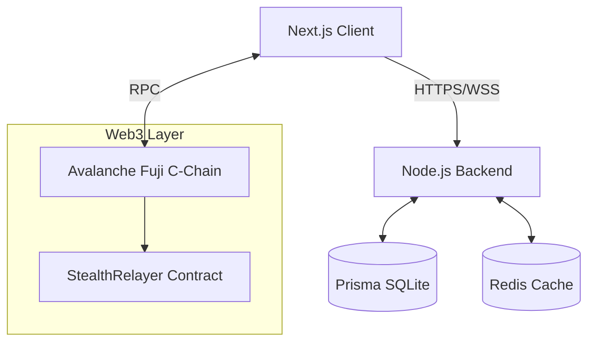
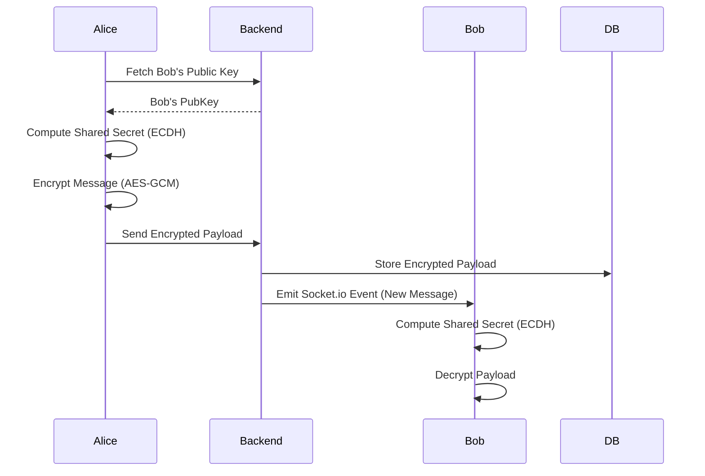
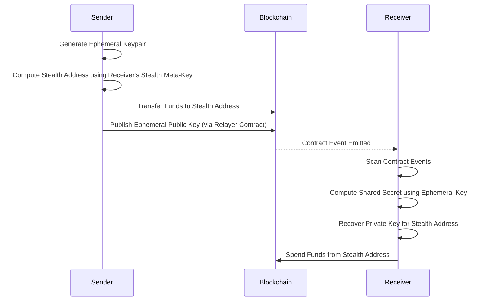

# System Architecture: Confidential Messenger

## 1. High-Level Overview
Confidential Messenger is a secure Web3 communication and payment platform built on Avalanche.

## 2. End-to-End Encryption Flow
Messages are never stored in plain text. We utilize standard public-key cryptography (ECDH + AES-GCM) to ensure privacy.

## 3. Confidential Payment Flow (Stealth Addresses)
To prevent blockchain analysis from linking sender and receiver, payments are sent to dynamically generated one-time addresses (Stealth Addresses).

