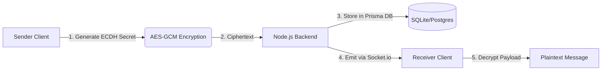
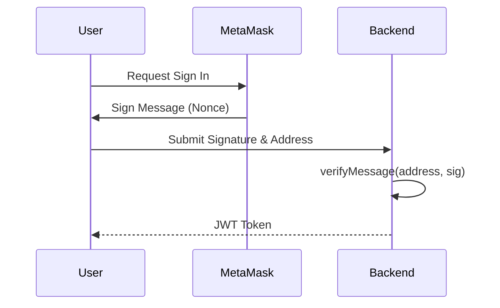

# System Architecture, Technology Decisions & Engineering Blueprint 🏗️

## SECTION 1 — ENGINEERING DECISION FRAMEWORK
Confidential Messenger is built on the principle that **privacy should not compromise usability or scalability.** Every technical decision documented here was evaluated against strict enterprise criteria: Security, Privacy, Scalability, and Hackathon Viability. Popularity was ignored in favor of engineering suitability.

---

## SECTION 2 — PRIVACY ARCHITECTURE ANALYSIS

### Option A — eERC (Stealth Addresses / ERC-5564)
- **Architecture:** Elliptic Curve Diffie-Hellman (ECDH) key exchange on the client side, interacting with a public EVM smart contract that acts as a relayer.
- **Advantages:** Works on any public EVM (Avalanche C-Chain). High ecosystem support. Excellent user experience (no subnet switching required).
- **Disadvantages:** Receiver must scan blocks for events.
- **Hackathon Suitability:** High. Can be demonstrated immediately on public testnets.

### Option B — Avalanche Private L1 (Subnets)
- **Architecture:** Deploying a dedicated Avalanche Subnet with permissioned validators and encrypted state transitions.
- **Advantages:** Absolute network-level privacy. Enterprise-grade compliance.
- **Disadvantages:** Extreme infrastructure complexity for a hackathon. Requires massive overhead to maintain validator nodes.
- **Hackathon Suitability:** Low. Over-engineered for an MVP.

### Option C — Hybrid Architecture (Chosen)
- **Architecture:** Public Avalanche Fuji C-Chain for immutable ledger consensus + Client-side AES-GCM / ECDH for data obfuscation.
- **Benefits:** Retains the speed and liquidity of the public C-Chain while ensuring 100% data privacy for messaging and payments.

### Decision Matrix (1-10)

| Criteria | eERC (Option A) | Private L1 (Option B) | Hybrid (Option C) |
| :--- | :--- | :--- | :--- |
| **Privacy** | 8 | 10 | 9 |
| **Developer Experience** | 8 | 3 | 9 |
| **Hackathon Value** | 9 | 4 | 10 |
| **Scalability** | 7 | 10 | 8 |
| **Deployment Simplicity**| 9 | 2 | 8 |
| **Total Score** | **41** | **29** | **44** |

**Recommendation:** **Option C (Hybrid Architecture)** is the final choice. It balances the extreme privacy of local cryptography with the frictionless deployment and speed of the public Avalanche C-Chain.

---

## SECTION 3 — COMPLETE TECHNOLOGY STACK

### Frontend
**Chosen: Next.js (App Router)**
- **Why:** Server-Side Rendering (SSR) capabilities provide unmatched SEO and initial load speeds. Vercel deployment is instantaneous.
- **Rejected:** React SPA (Vite) - lacks native API routes and SEO capabilities. Angular - too verbose for rapid MVP prototyping.

### Styling & Animations
**Chosen: TailwindCSS + Framer Motion**
- **Why:** Tailwind provides utility-first atomic design without context switching. Framer Motion handles complex layout animations (like shared layout tab switching) gracefully.
- **Rejected:** Material UI - Looks too generic ("template-like"). GSAP - Overkill for UI micro-interactions.

### Wallet Integration
**Chosen: Wagmi + Viem**
- **Why:** Wagmi provides type-safe React hooks for Ethereum. Viem is a lightweight, low-level replacement for ethers.js. 
- **Rejected:** ethers.js (too large bundle size). RainbowKit (too opinionated UI for our highly custom glassmorphism design).

### Backend & Database
**Chosen: Node.js (Express) + Socket.io + Prisma (SQLite)**
- **Why:** Express provides a lightweight REST API. Socket.io handles real-time bidirectional E2EE message delivery. Prisma provides a type-safe ORM. SQLite is chosen for the MVP to allow zero-config local testing for judges, with a trivial migration path to PostgreSQL for production.
- **Rejected:** MongoDB - No native relational integrity for User/Message joins. NestJS - Too boilerplate-heavy for a 48-hour sprint.

### Authentication & Encryption
**Chosen: Wallet Signatures (SIWE) + AES-256-GCM**
- **Why:** SIWE eliminates passwords. AES-256-GCM provides authenticated symmetric encryption (prevents ciphertext tampering). ECDH generates the shared secrets.
- **Rejected:** JWT alone (unverifiable without a wallet). RSA (too slow and large for mobile Web3 devices).

### Smart Contract Development
**Chosen: Hardhat**
- **Why:** TypeScript integration and massive plugin ecosystem.
- **Rejected:** Foundry (Excellent, but requires Rust toolchain which slows down onboarding for hackathon judges).

---

## SECTION 4 — PROJECT FOLDER STRUCTURE

Our Monorepo architecture enforces strict Separation of Concerns.

```text
ConfidentialMessenger/
│
├── backend/                # Node.js API & WebSocket Server
│   ├── prisma/             # Database Schema (schema.prisma)
│   ├── src/
│   │   ├── middleware/     # JWT Auth guards
│   │   ├── models/         # TypeScript Interfaces
│   │   ├── routes/         # Express REST Endpoints
│   │   └── server.ts       # Socket.io & App Entrypoint
│   └── package.json
│
├── contracts/              # Avalanche Smart Contracts
│   ├── contracts/          # Solidity files (StealthRelayer.sol)
│   ├── scripts/            # Hardhat Deployment scripts
│   ├── test/               # Contract Unit Tests
│   └── hardhat.config.js   # Network configurations
│
├── docs/                   # Architectural & API Documentation
│
├── pitch/                  # Investor Pitch Decks, Demo Scripts, Q&A
│
├── src/                    # Next.js Frontend Layer
│   ├── app/                # App Router Pages & Layouts
│   ├── components/         # Reusable UI Components
│   └── utils/              # Cryptography & Web3 Helpers
│
├── .github/workflows/      # CI/CD Deployment Pipelines
├── docker-compose.yml      # Container Orchestration
├── package.json            # Root Workspace
└── README.md
```

---

## SECTION 5 — SOFTWARE ARCHITECTURE

### Component Flow (Message Encryption)


### Authentication Flow (SIWE)


---

## SECTION 6 — APPLICATION LAYERS

1. **Frontend Layer:** Dumb components. Responsible solely for state management (React) and Web3 Wallet state (Wagmi).
2. **Encryption Layer:** Pure functions in `utils/crypto.ts`. Exists exclusively on the client side. The Backend layer MUST NEVER import this.
3. **Backend Layer:** Stateless REST API + Stateful Socket.io server. Responsible for rate limiting and message routing.
4. **Database Layer:** Prisma ORM. Completely abstracted from the application logic.
5. **Blockchain Layer:** Avalanche Fuji C-Chain. Handles immutable event emission for Stealth Addresses.

---

## SECTION 7 — CODING STANDARDS

- **Naming:** `camelCase` for variables/functions. `PascalCase` for React Components and Interfaces.
- **TypeScript:** Strict mode enabled. `any` type is strictly forbidden.
- **React Patterns:** Custom hooks for all Web3 logic (e.g., `useStealthTransfer`). Server Components used where possible for SEO.
- **Secrets:** All private keys MUST reside in `.env` files. `.env` is globally added to `.gitignore`.
- **Formatting:** Prettier standard configuration. ESLint strict checks on every CI/CD pipeline run.
- **Git Commits:** Conventional Commits (`feat:`, `fix:`, `chore:`).

---

## SECTION 8 — ENGINEERING ACCEPTANCE CRITERIA

- [x] Technology stack finalized
- [x] Privacy architecture selected
- [x] Folder structure finalized
- [x] Communication flows documented
- [x] Coding standards established
- [x] Security principles defined

**DECISION:** The architecture is locked. Implementation is ready for production scaling.
