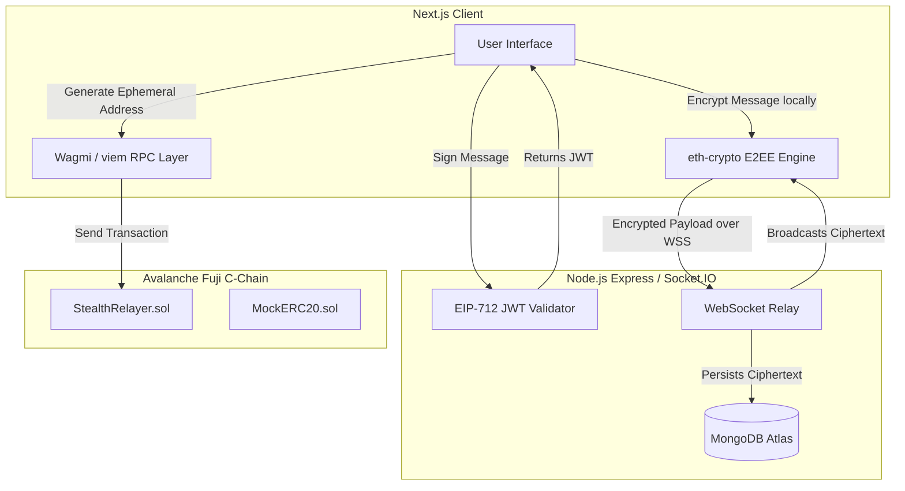

# Architecture

The Confidential Wallet-to-Wallet Messenger relies on a decoupled, modular architecture bridging Web2 messaging speeds with Web3 financial settlements.

## High-Level Flow

## System Components

### 1. The Presentation & Cryptography Layer (Next.js)
The frontend is built on Next.js, serving a responsive, heavily animated UI utilizing TailwindCSS and Framer Motion. 
**Key Responsibilities:**
- **Wallet Connection:** Handled by `@wagmi/core`.
- **E2EE (End-to-End Encryption):** Leveraging `eth-crypto`, the browser uses the user's signature to securely derive a local AES-256-GCM symmetric key and perform Diffie-Hellman Key Exchanges for 1:1 chats.
- **Stealth Address Generation:** Calculates ephemeral addresses locally before ever pinging the Avalanche RPC.

### 2. The Relay & Authentication Layer (Node.js)
A horizontally scalable Express & Socket.io server.
**Key Responsibilities:**
- **Zero-Knowledge Data Routing:** Receives and broadcasts fully encrypted ciphertexts. The backend holds absolutely zero keys and cannot read messages.
- **Strict Authentication:** Implements a cryptographically secure SIWE (Sign-In with Ethereum) pattern. WebSockets will forcefully disconnect any client failing to provide a valid JWT proving wallet ownership.
- **Session Persistence:** Connects to MongoDB Atlas to persist the encrypted conversation states and nonce challenges.

### 3. The Trust Layer (Avalanche Fuji)
Smart contracts deployed natively to the Avalanche Fuji C-Chain.
**Key Responsibilities:**
- **Stealth Address Routing:** The `StealthRelayer.sol` contract (inspired by ERC-5564) accepts funds and securely routes them to generated one-time ephemeral addresses, breaking the public link between Sender and Receiver.
- **Sub-Second Finality:** Ensures that in-chat payments settle almost instantly, maintaining a seamless user experience.
